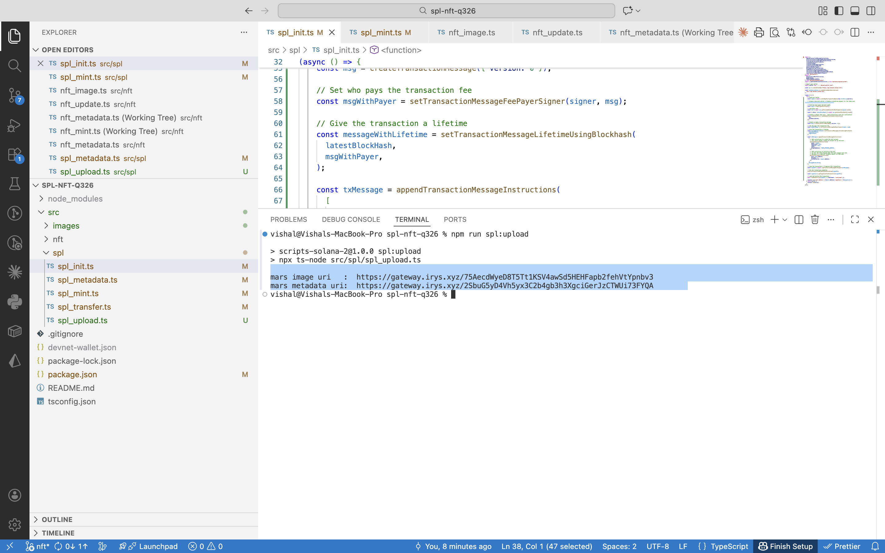
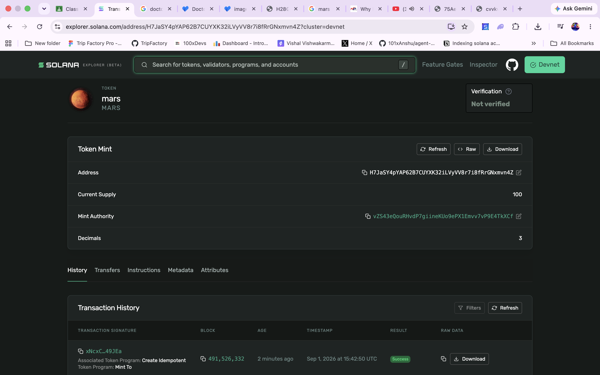
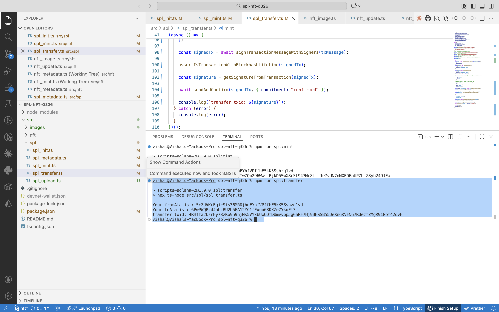
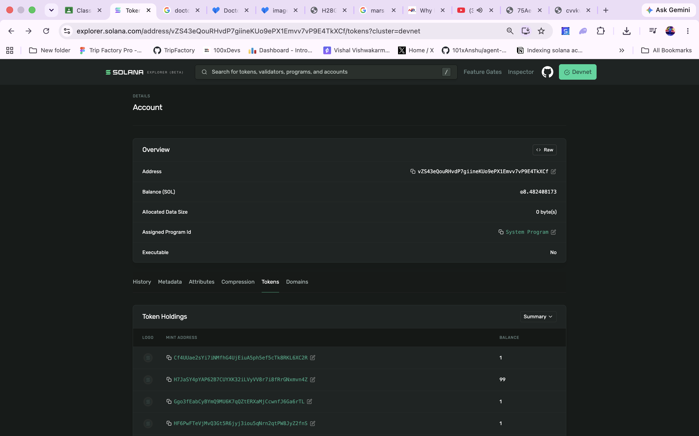
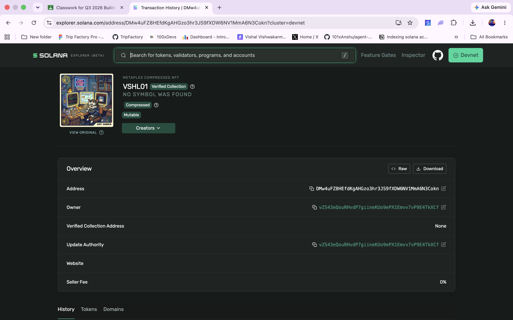
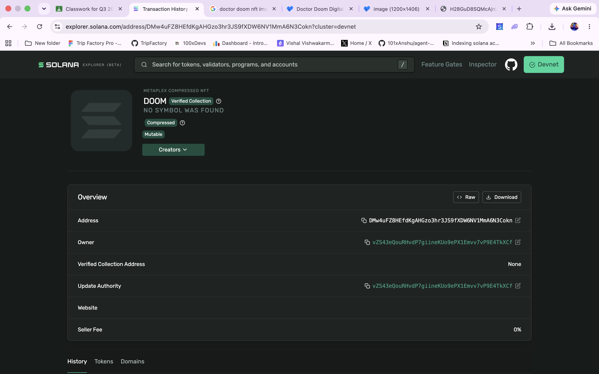

# spl-nft-q326

Three things, all on Solana devnet, all done with scripts in this repo:

**①** launch a fungible SPL token and send it &nbsp;·&nbsp; **②** mint an NFT with MPL Core &nbsp;·&nbsp; **③** rename that NFT as its update authority

Built with **@solana/kit** + **@solana-program/token** for raw transactions, **Metaplex UMI** for metadata, and **Irys** for storage.

---

## Setup

```bash
npm install
```

Drop your devnet keypair at `devnet-wallet.json` (a JSON array of bytes) and your images in `src/images/`. Every script reads the wallet from there and defaults to `https://api.devnet.solana.com`.

---

## ① SPL token — "mars"

A fungible token with **3 decimals**, so the smallest holdable slice is `0.001 mars`. Minted exactly **100**, then sent **1** to another wallet.

| Step | Command | What it does |
|---|---|---|
| 1 | `npm run spl:upload` | Uploads `mars.jpg` to Irys, wraps it in a metadata JSON, uploads that too |
| 2 | `npm run spl:init` | Creates the mint account with `decimals: 3` |
| 3 | `npm run spl:metadata` | Attaches name `mars` / symbol `MARS` via Token Metadata |
| 4 | `npm run spl:mint` | Creates your ATA and mints 100.000 mars into it |
| 5 | `npm run spl:transfer` | `transferChecked` — 1.000 mars to the recipient |

Step 1 prints two URIs. The **second** one — the JSON — is what goes on-chain; the JSON is what points at the picture.



And there it is on Explorer — logo pulled from the metadata, supply `100`, decimals `3`:



The transfer, ATA to ATA:



Balance after — `99` left of the original 100:



---

## ② NFT via MPL Core

One `create()` call from `@metaplex-foundation/mpl-core`. A Core asset is a **single account** — no mint, no ATA, ownership is a field inside the asset itself.

| Step | Command | What it does |
|---|---|---|
| 1 | `npm run nft:image` | Uploads the artwork to Irys |
| 2 | `npm run nft:metadata` | Builds the Core JSON schema and uploads it |
| 3 | `npm run nft:mint` | `create()` — mints the asset to your wallet |

Minted as **VSHL01**:



> **Why "No Symbol was found"?** Core stores only `name` and `uri` on-chain — there is no `symbol` field in the standard. The symbol lives in the off-chain JSON. Nothing is broken.

---

## ③ Update the NFT

```bash
npm run nft:update
```

Set `NEW_NAME` and/or `NEW_URI` in [`src/nft/nft_update.ts`](src/nft/nft_update.ts) first. The script fetches the asset, **checks your wallet is the update authority**, sends `update()`, then re-fetches so you can see the before/after.

`VSHL01` → **`DOOM`**, signed by the update authority:



Only `name` and `uri` are updatable on-chain. To change the image or attributes you re-upload the JSON (Irys is immutable) and point `uri` at the new one.

---

## Receipts

**SPL token — mars**

| | |
|---|---|
| Mint | `H7JaSY4pYAP62B7CUYXK32iLVyVV8r7i8fRrGNxmvn4Z` |
| Decimals / supply | `3` / `100.000` |
| Metadata JSON | [`2SbuG5yD…`](https://gateway.irys.xyz/2SbuG5yD4Vh5yx3C2b4gb3h3XgciGerJzCTWUi73FYQA) |
| Mint tx | `xNcxCb3BGoEnZXzeoZb7Y8WKiTwZQm296WwsLBjkD55wX8cSt947Nr8LtiJe7vdN7nNXEDEaUPZbiZ8yb249JEa` |
| Transfer tx | `4RHffa2kzrHy78zKo9n9hjNs5VYxbUwQDfDUmvvppJgGhRF7Hj9BHSSB55DeXn6KVFN67RdezfZMgR91Gbt42qvF` |

**NFT — Core asset**

| | |
|---|---|
| Asset | `DMw4uFZ8HEfdKgAHGzo3hr3JS9fXDW6NV1MmA6N3Cokn` |
| Mint tx | `4hvfwd1pV13Xc33L58E64MbuwjGBMcXWtTDa8cotLeWgHjNQh8h875U29Wd1MGo8CzdyDEq2DPyFv7ztuwfU6S4a` |
| Name | `VSHL01` → `DOOM` |
| Owner / update authority | `vZS43eQouRHvdP7giineKUo9ePX1Emvv7vP9E4TkXCf` |

---

## One thing worth knowing

Explorer lists the mars token under the wallet, but **not** the Core NFT. Both are genuinely owned — the difference is indexing:

| | SPL token | Core NFT |
|---|---|---|
| Ownership recorded in | a separate ATA (a PDA) | a field inside the asset account |
| Accounts | mint + ATA | one |
| Indexed by RPC | ✅ `getTokenAccountsByOwner` | ❌ needs a DAS indexer |

`getTokenAccountsByOwner` is a dedicated, indexed RPC method that exists only for the Token program. There's no equivalent for Core, so wallet-page listings miss it.

---

## Scripts

```
spl:upload    spl:init    spl:metadata    spl:mint    spl:transfer
nft:image     nft:metadata    nft:mint    nft:update
```

Run each in order; paste the address or URI it logs into the next script.

**Docs:** [Solana tokens](https://solana.com/docs/tokens) · [Solana Kit](https://www.solanakit.com/) · [Token Metadata](https://www.metaplex.com/docs/smart-contracts/token-metadata) · [Metaplex Core](https://www.metaplex.com/docs/smart-contracts/core)
